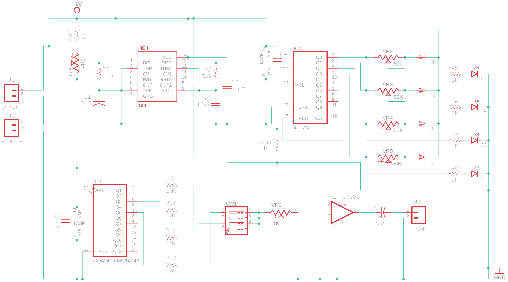

# Four-Step Octaved Sequencer

As featured in the blog post ["Prototype Post-Mortem: Four-Step Octaved Sequencer"](https://blog.tommy.sh/posts/prototype-post-mortem-four-step-octaved-sequencer/), these are the prototype PCB designs for a (yet to be totally finished) fun little noise toy.

The PCB and its electronics are possibly available as a [DIY electronics kit](https://www.oskitone.com/product/four-step-octaved-sequencer-kit). This repo serves as the assembly guide for the kit, as well as the EAGLE project so you can fabricate your own from scratch, should you want to!

**Demo video:** [https://vimeo.com/501110534](https://vimeo.com/501110534)

## Assembly guide

### Schematic

### Annotated BOM

| Part | Value   | Device                                            | Marking            | Purpose                                         |
| ---- | ------- | ------------------------------------------------- | ------------------ | ----------------------------------------------- |
| C1   | 10uF    | Polarized, electrolytic capacitor                 |                    | Tempo timer                                     |
| C2   | .1uF    | Ceramic capacitor                                 | 104                | 556 IC bypass                                   |
| C3   | 10nF    | Ceramic capacitor                                 | 103                | Pitch timer                                     |
| C4   | .1uF    | Ceramic capacitor                                 | 104                | 4017 IC bypass                                  |
| C5   | .1uF    | Ceramic capacitor                                 | 104                | 4040 IC bypass                                  |
| C6   | 220uF   | Polarized, electrolytic capacitor                 |                    | Amplifier                                       |
| D1   |         | Diode                                             |                    | Step 1 output                                   |
| D2   |         | LED                                               |                    | Step 1 indicator                                |
| D3   |         | Diode                                             |                    | Step 2 output                                   |
| D4   |         | LED                                               |                    | Step 2 indicator                                |
| D5   |         | Diode                                             |                    | Step 3 output                                   |
| D6   |         | LED                                               |                    | Step 3 indicator                                |
| D7   |         | Diode                                             |                    | Step 4 output                                   |
| D8   |         | LED                                               |                    | Step 4 indicator                                |
| IC1  | 556     | 556 Dual 555 timer                                |                    | Timers for tempo (on left) and pitch (on right) |
| IC2  | 4017    | 4017 counter/divider                              |                    | Decade counter for steps                        |
| IC3  | 4040    | CD4040 or MC14040, 12-stage binary/ripple counter |                    | Divides pitch frequency into octaves            |
| IC4  | 386     | LM386, low voltage audio power amplifier          |                    | Amplifier                                       |
| J1   | ON/OFF  | Header connection                                 |                    | For external switch (not included)              |
| J2   | - 9V +  | Header connection                                 |                    | 9v battery snap                                 |
| J3   | - SPK + | Header connection                                 |                    | To 8ohm speaker                                 |
| R1   | 680     | Resistor                                          | Blue Grey Brown    | Max tempo                                       |
| R2   | 220     | Resistor                                          | Red Red Brown      | Tempo timer                                     |
| R3   | 5.6k    | Resistor                                          | Green Blue Red     | Pitch timer                                     |
| R4   | 10k     | Resistor                                          | Brown Black Orange | Counter pulldown                                |
| R5   | 1K      | Resistor                                          | Brown Black Red    | For step 1 LED                                  |
| R6   | 1K      | Resistor                                          | Brown Black Red    | For step 2 LED                                  |
| R7   | 1K      | Resistor                                          | Brown Black Red    | For step 3 LED                                  |
| R8   | 1K      | Resistor                                          | Brown Black Red    | For step 4 LED                                  |
| R9   | 10k     | Resistor                                          | Brown Black Orange | Mixer for octave 1                                |
| R10  | 10k     | Resistor                                          | Brown Black Orange | Mixer for octave 2                                |
| R11  | 10k     | Resistor                                          | Brown Black Orange | Mixer for octave 3                                |
| R12  | 10k     | Resistor                                          | Brown Black Orange | Mixer for octave 4                                |
| SW1  |         | 4 position SPST DIP Switch                        |                    | Octave mutes                                    |
| VR1  | 50K     | Variable resistor                                 | 503                | Tempo                                           |
| VR2  | 50K     | Variable resistor                                 | 503                | Step 1 pitch                                    |
| VR3  | 50K     | Variable resistor                                 | 503                | Step 2 pitch                                    |
| VR4  | 50K     | Variable resistor                                 | 503                | Step 3 pitch                                    |
| VR5  | 50K     | Variable resistor                                 | 503                | Step 4 pitch                                    |
| VR6  | 1K      | Variable resistor                                 | 102                | Volume                                          |

Notes:

- Be sure to match polarity on electrolytic caps, diodes, and LEDs! The longer leg of the LED is positive
- The four ICs don't solder directly to the PCB. Instead, solder the included sockets, then insert ICs.
- IC3 may be marked as either CD4040 or MC14040. The two models are pin-for-pin compatible.
- The J1 (on/off) header is included for convenience if you have a switch you'd like to use. If not, short the two pads together.

### Hacking

All done? Try these ideas:

- Swap out for a bigger speaker to really hear the bass
- Increase gain on the [386](https://www.ti.com/lit/ds/symlink/lm386.pdf) with a 10uF cap between pins 1 and 8
- Try bigger pots for the step tuners
- Increase R1 for reaaalllly looongggg steeeppsssssssss
- Swap R9-12 with pots to get individual volume controls for each octave as they mix together
- The [4040](https://www.ti.com/lit/ds/symlink/cd4040b.pdf) has 12 "octave" outputs but we're only using four...

## Known issues

This PCB was last updated April 2018. In addition to the issues from the [post-mortem](https://blog.tommy.sh/posts/prototype-post-mortem-four-step-octaved-sequencer/):

- Some footprints are slightly mis-sized and require bending leads
- Volume control is linear instead of logarithmic, so range sweep isn't great
- Battery and speaker wires need relief holes to prevent breakage over time

## Version log

- **1.1.2**: Adds IC, header, and polarity labels; reorders octaves
- **1.1.1**: Adds mounting screw holes and a header for on/off switch (not included)
- **1.1**: Initial version featured in the blog post

## License

Designed by Oskitone. Please support future synth projects by purchasing from [Oskitone](https://www.oskitone.com/).

Creative Commons Attribution/Share-Alike, all text above must be included in any redistribution. See license.txt for additional details.
